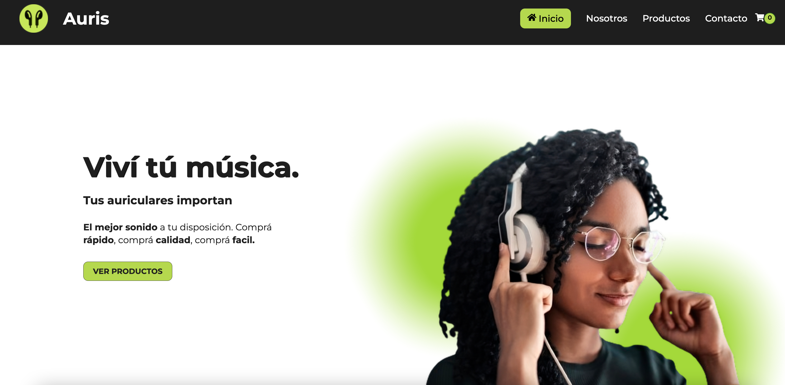
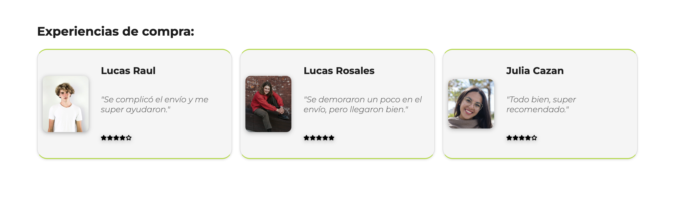
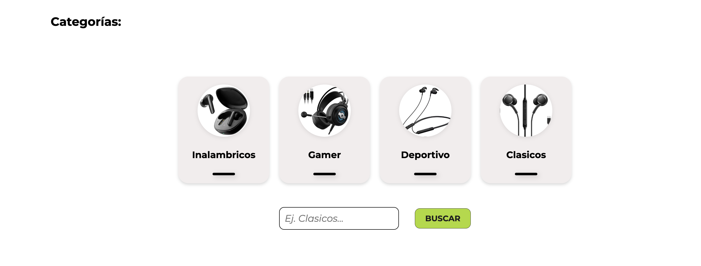
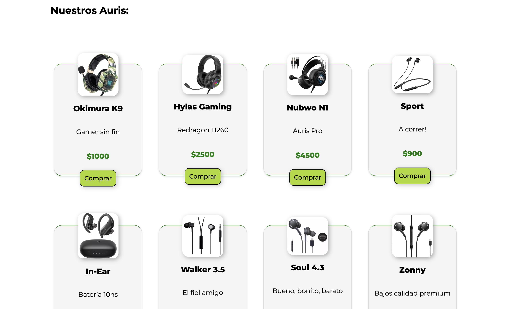
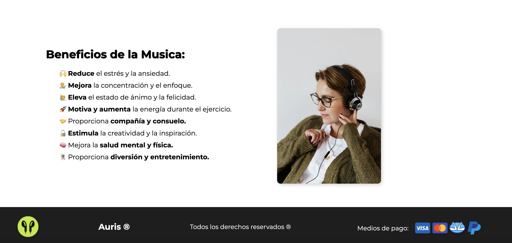

<h2 align="start">Auris.</h2> 

<!-- <h3 align="start">Lenguajes, herramientas y librerías utilizadas para el proyecto: </h3>  -->

Son mis primeros pasos con <strong> React,</strong> en éste proyecto me inicio en el camino de la modularización de código y la re utilización de comonentes, además es el primer proyecto con una estructura compleja con el que trabajo. 

Este proyecto es un e-commerce de auriculares desarrollado en React, cumpliendo con las indicaciones del módulo de React de NUCBA. El proyecto permite a los usuarios explorar una variedad de auriculares, agregarlos al carrito y realizar compras. El sitio es totalmente responsive y tiene funcionalidades avanzadas para mejorar la experiencia del usuario.

<h3>Características del proyecto:</h3>

- <b>  React Router:</b> para manejar la navegación entre páginas.
- <b> Redux:</b> que me permite la gestión del estado global del sitio, facilitando la gestión de estados complejos.
- <b>Renderizado dinámico en el DOM</b> de los productos.
- <b>Diseño Responsive:</b> Todas las páginas son adaptables a diferentes dispositivos.
- <b>Persistencia del Carrito:</b> Los productos del carrito se persisten para mantener la experiencia del usuario.
- Implementación de <b>algorítmos</b> uno se encarga de renderizar productos recomendados de manera aleatoria y otro de mostrar opiniones de compra de distintas personas usuarias.

<h4>&#128640;  Herramientas de desarrollo y ejecución:</h4>

-   Me sirvo de <strong> Node.js </strong> como entorno de ejecución.  
- <strong> Vite.js</strong> me ofrece un entorno de desarrollo  rápido y liviano. 

<h4>&#128193; Librerías utilizadas:</h4> 

- <strong> Styled Component </strong> para el manejo de estilos,
- <strong> Formik </strong> y <strong> Yup </strong> para validación de formularios,  
- <strong> Framemotion </strong> para animaciones y transiciones. 
- <strong> Fontsource </strong> para la tipografía personalizada.

<h4>&#129309; Diseño del proyecto:</h4>

- Diseño de logo
- Diseño de Hero representativo, en la creación de la img principal utilicé el color verde, apelando a su connotación amable, de bienestar y estabilidad. 
- Manejo los estilos del proyecto de manera global desde mi archivo <strong> GlobalStyles.js </strong> logrando por un lado mayor orden de código y por el otro, una escalabilidad a futuro.

<h4>&#128248; Screens:</h4>

Hero del sitio

 
Algoritmo que renderiza experiencias de compra:

 

Categorias de compra:

Cards de productos:

Sección representativa de about:

 

El proyecto se encuentra desplegado en <b>Vercel</b>, puedes visitarlo <a href="https://auris-phi.vercel.app/" target="_blank" >aquí</a>.

