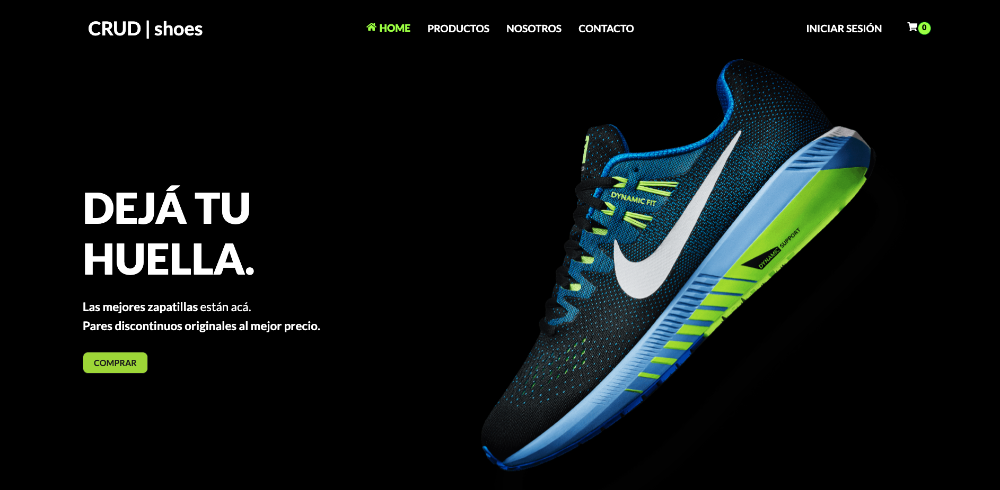

<h1 align="start">CRUD | Shoes</h1> 

<h4 align="start">If you clone it at least give me a star in the repo ⭐️ </h4> 

First <strong> FULL STACK MERN</strong> project about an e-comerce allows the purchase of discontinued pairs of original sneakers. Users can register and once their account is validated they can make the purchase and also have a history of their orders. 

You can visit Web Site:  

<a href="https://crud-shoes.vercel.app/" target="_blank" style="display: inline-block; padding: 8px 15px; font-size: 12px; color: white; background-color: green; border-radius: 10px; text-decoration: none;">
  CLICK HERE
</a>

 
Besides, you can view the backend code in my GitHub profile. 

<h3>&#128640; Development and execution tools:</h3>

- I use <strong> Node.js </strong> as the execution environment.
- <strong> Vite.js </strong> offers me a fast and lightweight development environment.
- <strong> React.js </strong> for the development of the user interface.
- <strong> MongoDB and MongoAtlas </strong> for the creation of the NoSQL database.
- <strong> Express.js </strong> to be able to use the middleware architecture in the HTTP requests to the backend.

<h3>Project Features:</h3>

- <b> React Router:</b> to handle navigation between pages.
- <b> Redux:</b> that allows me to manage the global state of the site, facilitating the management of complex states.
- <b> Dynamic rendering in the DOM </b> of the products.
- <b> Responsive Design:</b> All pages are adaptable to different devices.
- <b> Persistence of the cart and user data:</b> The products in the cart are persisted to maintain the user experience.
- Implementation of <b> algorithms </b> one is responsible for rendering recommended products randomly and another for showing purchase opinions from different users.

<h3>&#128193; Frameworks used:</h3>

- <strong> Styled Component </strong> for style management,
- <strong> Formik </strong> and <strong> Yup </strong> for form validation,
- <strong> Framermotion </strong> for animations and transitions.
- <strong> Icons </strong> for logos.
- <strong> Fontsource </strong> for custom typography.
- <strong> Axios </strong> to handle HTTP requests from the browser and Node.js
- <strong> Cors </strong> as middleware to facilitate and improve the configuration and management of CORS headers since I use Express.js.
- <strong> Nodemailer + jsonwebtoken + express-validator </strong> for the verification of user accounts that wish to register in the e-commerce.

<h3>&#129309; Project design:</h3>

- Logo design
- Hero design representing the business.
- I manage the project's styles globally from my <strong> GlobalStyles.js </strong> file, achieving greater code order and future scalability.

<h4>&#128248; Screens:</h4>

Home:

 
Login:

 

Checkout:

 
Products:

  

